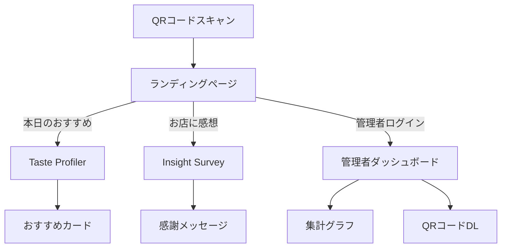

# 機能仕様書

## 1. 機能一覧・詳細仕様
### 1.1 QRコードランディングページ
- 概要: QRコードからアクセスした際の選択画面
- 入力: なし
- 出力: 「本日のおすすめを見つける」「お店に感想を伝える」ボタン
- バリデーション: なし
- 権限: 全ユーザー
- 例外: アクセス不可時はエラーメッセージ表示

### 1.2 Taste Profiler
- 概要: 質問に答えるとおすすめメニューを表示
- 入力: 質問4問の選択肢
- 出力: おすすめカード
- バリデーション: 全問回答必須
- 権限: 全ユーザー
- 例外: 未回答時はエラー表示

### 1.3 Insight Survey
- 概要: アンケートに回答し、感謝メッセージを表示
- 入力: 質問4問の選択肢
- 出力: 感謝メッセージ
- バリデーション: 全問回答必須
- 権限: 全ユーザー
- 例外: 未回答時はエラー表示

### 1.4 管理者ダッシュボード
- 概要: ログイン、集計グラフ、QRコードDL
- 入力: ログイン情報
- 出力: 集計グラフ、QRコード
- バリデーション: ログイン必須
- 権限: 管理者のみ
- 例外: ログイン失敗時はエラー表示

## 2. ユースケース記述
### 2.1 顧客：おすすめメニューを知りたい
- 前提条件: QRコードをスキャンし、スマホでアクセス
- 基本フロー: ランディング→Taste Profiler選択→質問回答→おすすめ表示
- 代替フロー: 途中で戻る/再回答
- 例外フロー: 通信エラー時はリトライ案内

### 2.2 顧客：アンケートに答えたい
- 前提条件: QRコードをスキャンし、スマホでアクセス
- 基本フロー: ランディング→Insight Survey選択→質問回答→感謝メッセージ
- 代替フロー: 途中で戻る/再回答
- 例外フロー: 通信エラー時はリトライ案内

### 2.3 オーナー：集計をグラフで確認したい
- 前提条件: 管理者アカウントでログイン
- 基本フロー: ログイン→ダッシュボード表示→グラフ閲覧
- 代替フロー: 期間指定・再集計
- 例外フロー: ログイン失敗時は再入力案内

### 2.4 オーナー：QRコードをダウンロードしたい
- 前提条件: 管理者アカウントでログイン
- 基本フロー: ログイン→ダッシュボード→QRコードDL
- 代替フロー: QRコード再発行
- 例外フロー: ダウンロード失敗時は再試行案内

## 3. 画面仕様
### 3.1 画面項目一覧・詳細
- ランディング：選択肢ボタン2つ、説明文、ロゴ
- Taste Profiler：質問（4問）、選択肢ボタン、送信ボタン、おすすめカード（画像・説明・スタッフへの提示案内）
- Insight Survey：質問（4問）、選択肢ボタン、送信ボタン、感謝メッセージ
- 管理者ダッシュボード：ログインフォーム、集計グラフ（円・棒）、QRコードDLボタン、期間指定、ログアウト

### 3.2 画面遷移図

## 4. APIインターフェース仕様（抜粋）
- POST /api/taste-profiler/submit
  - 入力: { answers: [string] }
  - 出力: { recommendation: string, imageUrl: string }
  - エラー: 400（未回答）、500（サーバーエラー）
- POST /api/insight-survey/submit
  - 入力: { answers: [string] }
  - 出力: { message: string }
  - エラー: 400, 500
- POST /api/admin/login
  - 入力: { username: string, password: string }
  - 出力: { token: string }
  - エラー: 401, 500
- GET /api/admin/summary
  - 入力: token
  - 出力: { stats: object }
  - エラー: 401, 500
- GET /api/admin/qr-download
  - 入力: token
  - 出力: QRコード画像
  - エラー: 401, 500

## 5. 権限・ロール
- 顧客：Taste Profiler、Insight Survey利用可
- 管理者：ダッシュボード、集計、QRコードDL利用可

## 6. 通知・エラー表示・ユーザーフィードバック
- 通信エラー時は「通信に失敗しました。再度お試しください」と表示
- 入力エラー時は「すべての質問に回答してください」と表示
- 成功時は「ご協力ありがとうございました」等のメッセージ表示

## 7. 非機能的な画面要件
- レスポンシブデザイン（スマホ・タブレット・PC対応）
- 1秒以内の画面表示
- アクセシビリティ（色覚対応、フォントサイズ調整等）

## 8. 将来拡張・カスタマイズ性
- 質問内容・選択肢の管理画面からの変更
- 多言語対応の追加設計余地
- 新規アンケート項目の追加容易性

---

（本ドキュメントは今後の要件追加・変更に応じて随時アップデートします） 