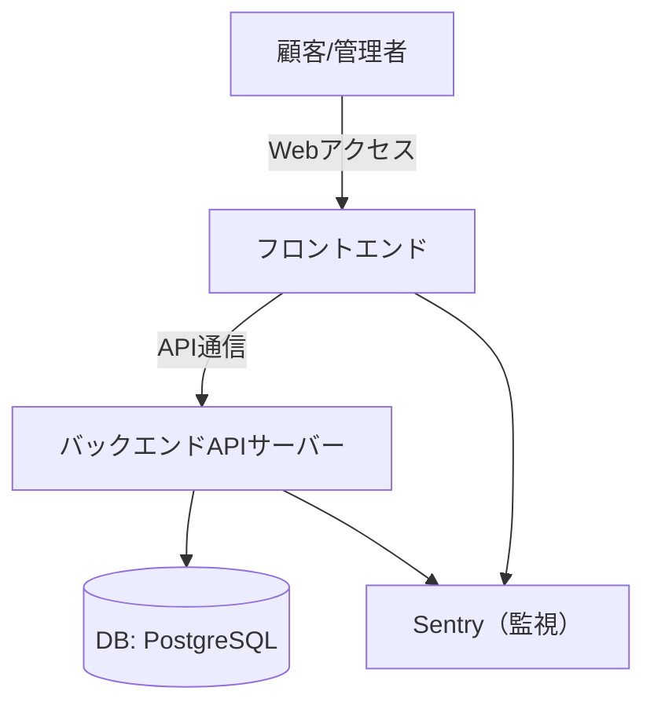
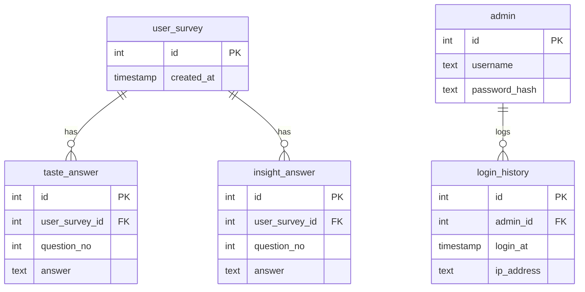

# 技術設計書

## 1. システムアーキテクチャ図・構成

- フロントエンド：React/Vue等で実装、スマホ・PC対応
- バックエンド：Node.js/Express等、REST API提供
- DB：PostgreSQL、顧客回答・集計・管理者情報を管理
- Sentry：エラー・パフォーマンス監視
- GitHub：ソース管理、CI/CD連携

## 2. 通信フロー・外部連携
- 顧客/管理者はWebアプリにアクセス
- フロントエンドはAPIサーバーとHTTPS通信
- APIサーバーはDBへデータ保存・取得
- SentryはFE/BE両方からエラー・パフォーマンス情報を受信

## 3. データベース設計（ER図・詳細）

- 各テーブルのカラム・型・制約・リレーションを明記
- インデックス：user_survey.created_at, admin.username等

## 4. クラス図 / シーケンス図（UML）
（主要な処理・データフローを別途作成）

## 5. API設計書（詳細）
### 5.1 /api/taste-profiler/submit
- メソッド: POST
- 認証: 不要
- リクエスト: { answers: [string] }
- レスポンス: { recommendation: string, imageUrl: string }
- エラー: 400, 500

### 5.2 /api/insight-survey/submit
- メソッド: POST
- 認証: 不要
- リクエスト: { answers: [string] }
- レスポンス: { message: string }
- エラー: 400, 500

### 5.3 /api/admin/login
- メソッド: POST
- 認証: Basic
- リクエスト: { username: string, password: string }
- レスポンス: { token: string }
- エラー: 401, 500

### 5.4 /api/admin/summary
- メソッド: GET
- 認証: Bearer Token
- リクエスト: token
- レスポンス: { stats: object }
- エラー: 401, 500

### 5.5 /api/admin/qr-download
- メソッド: GET
- 認証: Bearer Token
- リクエスト: token
- レスポンス: QRコード画像
- エラー: 401, 500

## 6. インフラ構成・運用設計
- GitHub Actions等でCI/CD自動化
- 本番・開発・検証環境の分離
- DBバックアップ・リストア手順
- Sentry監視・アラート設定
- 障害時のエスカレーションフロー

## 7. セキュリティ設計
- 通信の暗号化（HTTPS必須）
- 管理画面は認証必須、パスワードはハッシュ化
- APIは認証・認可を厳格に
- SQLインジェクション・XSS等の脆弱性対策
- ログイン試行回数制限・IP制限

## 8. パフォーマンス・スケーラビリティ設計
- API応答0.5秒以内、画面表示1秒以内
- DBインデックス設計、クエリ最適化
- 負荷分散・スケールアウト設計余地

## 9. 開発・運用フロー
- GitHub Flow準拠のブランチ運用
- コードレビュー・CI必須
- 本番リリースはPull Request経由
- Sentry・GitHub Issuesで障害・課題管理

---

（本ドキュメントは今後の要件追加・変更に応じて随時アップデートします） 